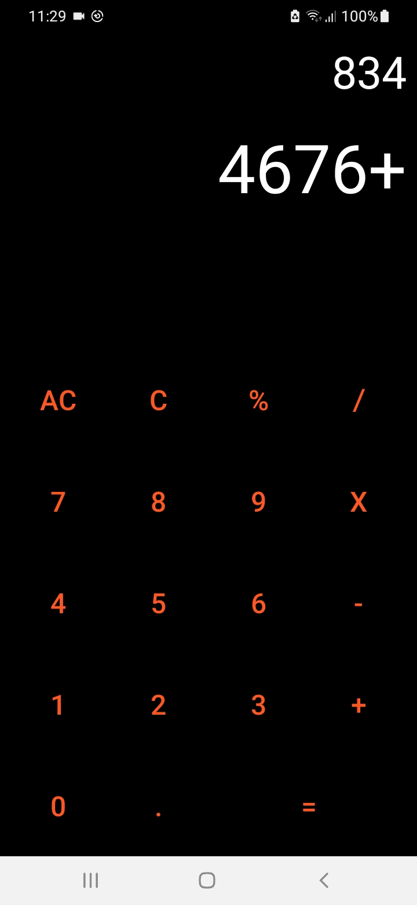

# MyCalc Android Calculator

Task-1 Calculator App 
MyCalc is a basic Android calculator app developed in Java using Android Studio.
Given by: Bharat Intern

## Features

- Perform basic mathematical operations (addition, subtraction, multiplication, division, percentage).
- User-friendly interface.

## Video Demo

Watch a video demonstration of the MyCalc app.

## Screenshots

